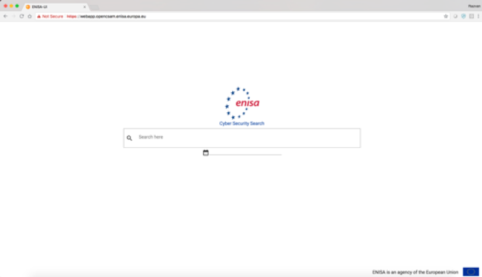
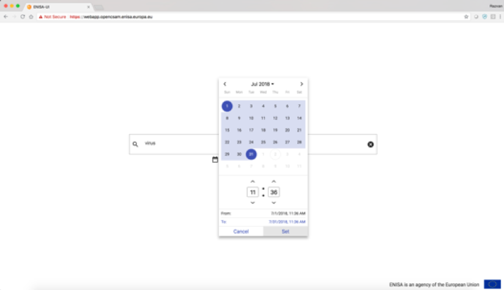
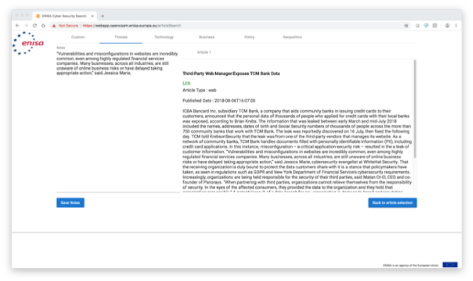
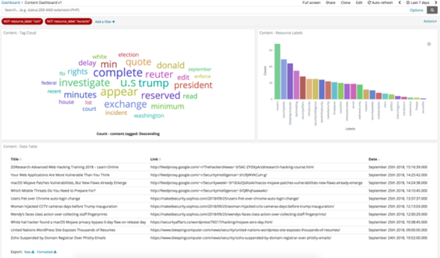
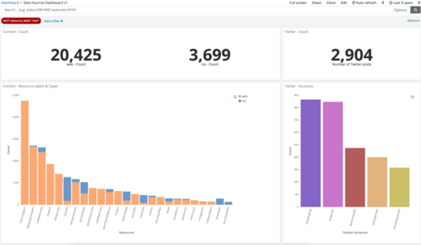
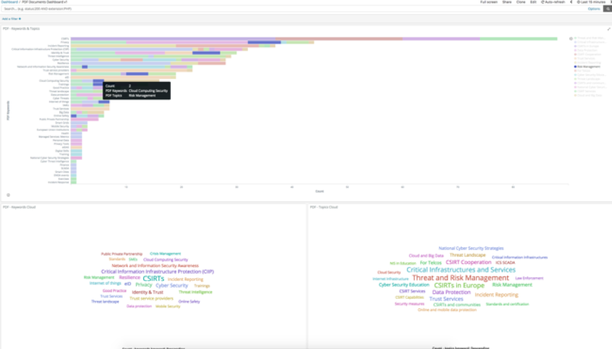
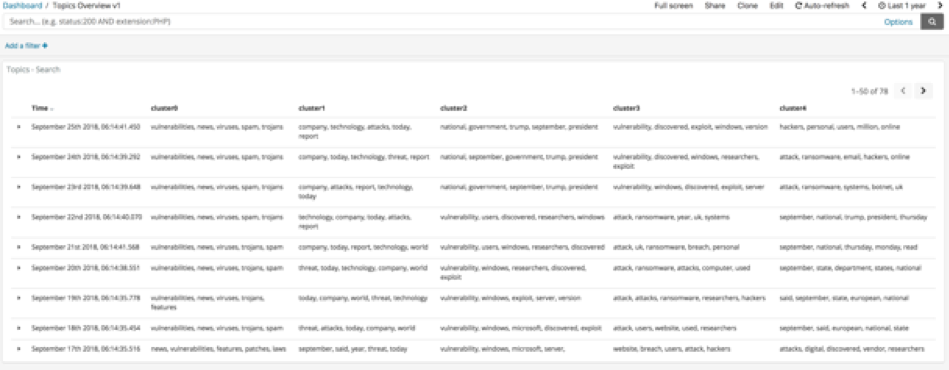

# Introduction

The main objective of the Open Cybersecurity Situation Awareness Machine (Open CSAM) is to optimize the production of cybersecurity situation awareness reports, by applying Natural Language Processing (NLP) and Machine Learning (ML) techniques that will allow for the automatic classification and generation of documents.

This user manual provides instructions for users how to use the prototype of Open CSAM.

The technology is based on Elasticsearch and can be accessed via Kibana and the Web Application. The links are as follows:

- https://kibana.opencsam.enisa.europa.eu/
- https://webapp.opencsam.enisa.europa.eu/

Consult the [Appendix](#appendix) on how to prepare the machine to acccess Kibana and the Web Application

# Web User Interface

## Home Page Search

The Web User Interface is the main entry point to Open CSAM.

It is accessible at this URL: https://webapp.opencsam.enisa.europa.eu/

The homepage of the application allows users to type in keywords to search for. By choosing the time interval, the search is filtered on. This is done by clicking on the date field as per the screenshots below:




If no time interval is selected, all captured data will be used. To start the search, press Enter.

## Custom and Pre-Defined Searches

Once the search has been initiated from the homepage, the user will be taken to a second screen where the results will be presented in the Custom tab by default. Other predefined searches are also available such as Threats, Technology, Business, Policy and Geopolitics.



In this screen, the user can still change the searched terms, or enhance the search by enabling the Time Decay and Popularity of Sources toggles. The knowledge graph is on by default but can be turned off as well. 

*Please refer to section The Knowledge Graph for more information about the knowledge graph and how to update the knowledge graph.* 

The toggles are intended to work as follows and can change score:

- **Knowledge Graph**: Expanding the search term by making use of the provided synonyms.
- **Time Decay**: Results that are older than a week get a lower score, so the most recent results
come on top.
- **Popularity Sources**: Adds an extra weight to predefined sources which have been deemed
popular.

For every tab, articles can be selected by clicking on the checkbox on the left of each article. Once the selection is complete, the following step is to go to the Report Editor screen by clicking on the **Report Editor** button from the bottom.

## Report Editor




All articles that have been previously selected will now be available on the right side of the report editor screen, for further reading. Depending on the type of article, they will contain either the full text (Web) or a short text (RSS).

This text can be copied and pasted on the Notes area on the left side of the screen.
The selection of articles is persistent and can be changed afterwards by going back to the results by pressing the **Back to article selection** button. This way the user can add new articles or remove previously selected ones.

The Notes are persistent throughout all tabs, so one report can be built for Threats, Policy and other topics at the same time if required.

Once the Notes area has been completed and the user is happy with the selected text, this can be saved to the user’s local system by pressing **Save notes** button which will save as plain text.

# Kibana Dashboards

Kibana lets you visualize your Elasticsearch data. Kibana core ships with the classics: histograms, line graphs, pie charts, sunbursts, and more. Open CSAM’s Kibana can be accessed be in the link below:

• https://kibana.opencsam.enisa.europa.eu/

Assuming that the basic knowledge of Kibana functionality is known (consult the [Appendix](#appendix) for more information), several functionalities for the user of Open CSAM is provided. 

Other than the basic Discover functions of Kibana, there are some pre-made dashboards provided for Open CSAM and can be accessed in Kibana under the tab ‘Dashboards’.

The general idea of these dashboards is to provide insights on the data ingested in Elasticsearch.

## Content Dashboard



The Content Dashboard provides information of the data ingested from Web and RSS. The upper left panel shows a Word Cloud of the most frequent words. The upper right panel shows a histogram from all the news sources. The bottom panel shows the latest articles that has been ingested. There is also a similar dashboard for only Twitter feeds available in Kibana which will not be discussed further in this manual.

## Data Sources Dashboard



The Data Sources dashboard provides an overview of the data ingested from the different data sources (Web, RSS or Twitter). Each data source is also split by the news source to gain more detailed information.

## PDF Documents Dashboard



The PDF Document Dashboard provides information about the content of the ingested PDF documents. The top panel shows per keyword corresponds to which topic. The bottom panels show word clouds of the keywords and topics.

## Topics Overview Dashboard


The Topics Overview provides the words corresponding to each cluster for every day. A cluster corresponds to a topic. By default, a script is run every day to find 5 clusters with corresponding words that define the specific cluster. For more detailed information about the algorithm behind this process, please view the NLP Research section of the Deployment, Troubleshooting and Solution manual.

# The Knowledge Graph

## Updating the knowledge graph

The knowledge graph provided by ENISA is the back bone of the information hierarchy understanding that is implemented in Elasticsearch. Elasticsearch makes it possible to define synonyms which serve well for the purposes of the information hierarchy understanding.

The knowledge graph/information hierarchy can be updated and subsequently exported into a synonym format that Elasticsearch will understand. While this is a somewhat technical procedure, it is important for the end user (i.e. Analyst) to understand it and be able to create the configuration file in text format.

Updating the knowledge graph can be done with the knowledge_graph.py script. The script uses the knowledge graph entered in the knowledge_graph.cfg configuration file in a text format as an input and prints out the synonyms on screen.

The configuration file should be written in the following way:

- The term in brackets defines a section in the configuration file and corresponds to one of the main legs from the knowledge graph, linked to the cyber security blob.
- The term that will be used for searching in Elasticsearch is defined in the category variable.
- In case there are multiple synonyms or abbreviations for this term, use a comma-separated
string
- The subcategories variable defines the lower level of the knowledge graph.
- Parents are written with an indent and children are written with an indent followed by a dot.

For example:

```conf
[threats]
category = Threats
subcategories =
  Web application attacks
  . Cross-Site Scripting, XSS
  . Local File Inclusion, LFI
  . Remote File Inclusion, RFI
  . SQL injection
  . Cross-Site Request Forgery, CSRF
```

# Appendix

Please view the section below to enable your laptop or computer to access these pages. 
The [Deployment, Troubleshooting and Solution manual](./35-TROUBLESHOOTING.md) provide more technical details about the architecture and services of Open CSAM.

## Enabling your laptop to access Open CSAM
To access Open CSAM, your computer needs to be configured on how to map DNS name to a specific IP address. This can be done by editing your local /etc/hosts file. Below are instructions based on your OS.

### Mac users
Open the terminal and run the script below:

```sh
sudo bash -c 'for s in "" "139.91.221.81
webapp.opencsam.enisa.europa.eu" "139.91.221.81
elastic.opencsam.enisa.europa.eu" "139.91.221.81
jenkins.pencsam.enisa.europa.eu" "139.91.221.81
kibana.opencsam.enisa.europa.eu"; do echo $s >> /etc/hosts; done'
```

If above scripts do not gain you access, the alternative is to edit your hosts file by running sudo vi /etc/hosts from the terminal and add these lines to the very end of the file.

```sh
139.91.221.81   webapp.opencsam.enisa.europa.eu
139.91.221.81   elastic.opencsam.enisa.europa.eu
139.91.221.81   jenkins.opencsam.enisa.europa.eu
139.91.221.81   kibana.opencsam.enisa.europa.eu
```

### Windows users

In Windows, the hosts file (/etc/hosts file) needs to be edited. Basically, the same lines needed to be added as the Mac users. Unfortunately, it is a bit more complex on Windows because of different Windows versions and configurations. Please see the tutorial in the link below: https://gist.github.com/zenorocha/18b10a14b2deb214dc4ce43a2d2e2992

```sh
139.91.221.81   webapp.opencsam.enisa.europa.eu
139.91.221.81   elastic.opencsam.enisa.europa.eu
139.91.221.81   jenkins.opencsam.enisa.europa.eu
139.91.221.81   kibana.opencsam.enisa.europa.eu
```

## Kibana resources

Since Elastic offers extensive instructions on using Kibana, links of the official tutorials are provided
below.
Basic knowledge of Kibana is assumed to be known for the use of Open CSAM.

Kibana Tutorials
Kibana Tutorial – Part 1: Introduction
Kibana Tutorial – Part 2: Discover
Kibana Tutorial – Part 3: Visualize
Kibana Tutorial – Part 4: Dashboard

Additional Kibana Tutorial videos are available on the official Elastic YouTube channel.
Kibana User Guide
The official online Kibana User Guide provides highly detailed information regarding all functions of the tool.
